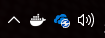
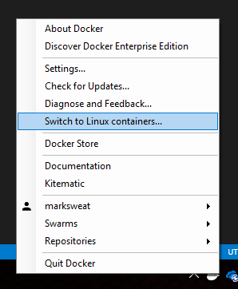

# Docker Training - Lab 1 - Hello Docker World

This lab will serve as a basic introduction to the Docker command line interface. It will cover how to pull existing Docker images and run them as containers locally.

### Prerequisites

Prior to starting this lab, you should have the appropriate version of Docker Community Edition for you operating system installed and running.  Any current version should work.

### Windows vs Linux

Although we will be primarily working with *Linux* images, these instructions are geared towards running your labs on a Windows-based machine.  On Linux, Docker requires elevated permissions.  Thus you would prepend `sudo` before any CLI commands.

## 1 - Check Docker Version

Open a command prompt or powershell command prompt. Run the following command to check your Docker version:

```
docker version
```

You should get a dump back that looks like this...

```
Client:
 Version:       17.12.0-ce
 API version:   1.35
 Go version:    go1.9.2
 Git commit:    c97c6d6
 Built: Wed Dec 27 20:05:22 2017
 OS/Arch:       windows/amd64

Server:
 Engine:
  Version:      17.12.0-ce
  API version:  1.35 (minimum version 1.24)
  Go version:   go1.9.2
  Git commit:   c97c6d6
  Built:        Wed Dec 27 20:15:52 2017
  OS/Arch:      windows/amd64
  Experimental: true
```

From here, you can see a lot of useful information about your base Docker.  When working with Docker, you have both a client and a server.  The server is the daemon process tht managages runing containers.  The client is the command line tools you use to interact with the daemon API.

## 2 - Switching to Linux containers (Windows 10 only)

From the output above, you can see that I am running on a Windows machine. Since the labs for this course are all designed for Linux, we need to swtich to the Linux daemon.  This is accomplished via the Windows taskbar system Icon for Docker.

First, right click on the Whale icon:



Next, select "Switch to Linux containers..."



Now, if you are like me and despise GUIs that don't have a command line or API alternative, you can switch daemons via the following Windows command line:

```
"c:\Program Files\Docker\Docker\DockerCli.exe" -SwitchDaemon
```

To verify that Linux containers are working, re-run the Docker version command. You should get something like this...

```
Client:
 Version:       17.12.0-ce
 API version:   1.35
 Go version:    go1.9.2
 Git commit:    c97c6d6
 Built: Wed Dec 27 20:05:22 2017
 OS/Arch:       windows/amd64

Server:
 Engine:
  Version:      17.12.0-ce
  API version:  1.35 (minimum version 1.12)
  Go version:   go1.9.2
  Git commit:   c97c6d6
  Built:        Wed Dec 27 20:12:29 2017
  OS/Arch:      linux/amd64
  Experimental: true
```

In a later lab, we will explore Windows containers a bit more. For now, we will leave our system connecting to the Linux daemon.

## 3 - Running the Hello World container

Since every technology learning path must begin with Hello World, Docker is no different.  Run the following command:

```
docker run hello-world
```

Running this, you get an output that looks something like this...

```
Unable to find image 'hello-world:latest' locally
latest: Pulling from library/hello-world
ca4f61b1923c: Pull complete
Digest: sha256:97ce6fa4b6cdc0790cda65fe7290b74cfebd9fa0c9b8c38e979330d547d22ce1
Status: Downloaded newer image for hello-world:latest

Hello from Docker!
This message shows that your installation appears to be working correctly.

To generate this message, Docker took the following steps:
 1. The Docker client contacted the Docker daemon.
 2. The Docker daemon pulled the "hello-world" image from the Docker Hub.
    (amd64)
 3. The Docker daemon created a new container from that image which runs the
    executable that produces the output you are currently reading.
 4. The Docker daemon streamed that output to the Docker client, which sent it
    to your terminal.

To try something more ambitious, you can run an Ubuntu container with:
 $ docker run -it ubuntu bash

Share images, automate workflows, and more with a free Docker ID:
 https://cloud.docker.com/

For more examples and ideas, visit:
 https://docs.docker.com/engine/userguide/
```

## Lab Complete

In this lab, we have learned how to:

* Check which version of Docker you are using
* Switch between Windows and Linux containers on Windows 10
* Run a simple container using the Docker CLI