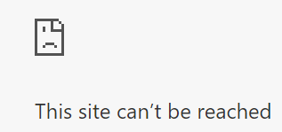

# Docker Training - Lab 2 - Docker CLI Basics

In the first lab, we got the Hello World container running on our machine. In this lab, we will further explore the basics of the Docker CLI.

## 1 - CLI Help

Docker provides a rich help system from the command line. The simplest help is accessible by the following command:

```
docker help
```

This command lists the various commands that the Docker CLI supports.  To get further details on one of these commands, you can pass it into the `help` command.  

Run the following command to learn more about the `run` command:

```
docker help run
```

Don't be overwhelmed by the numerous switches available to this command. You will never need to use many of them. In this and following labs, we will look at the more important basic switches.  For now, just be aware that anytime you cannot remember details about a command, you can look here.

Beyond the command line, documentation is available on the Docker website:

https://docs.docker.com

## 2 - Run Command

Let's go back to the run command we used in the last lab.  Try running this again:

```
docker run hello-world
```

You should notice a few things running this.  First, the output of the container run is identical to the prior run. Second, the container ran a lot faster this time since it didn't need to pull down the image again.

Let's get a little fancier and run a container that doesn't execute and terminate.  A good starter container is the Apache web server.  To start this up, lets run the following command:

```
docker run httpd
```

As before, Docker will pull down the image and run it locally.  This time, you will see that the process continues to run.  This is because you are running this container in *attached* mode, meaning that all STDIN, STDOUT and STDERR pipes are attached to your command shell.

## 3 - Container Command

Open up another command prompt. From this prompt, run this command:

```
docker container ls
```

You will get something like this:

```
CONTAINER ID        IMAGE               COMMAND              CREATED             STATUS              PORTS               NAMES
3268d04fca11        httpd               "httpd-foreground"   4 minutes ago       Up 4 minutes        80/tcp              happy_einstein
```

This shows you all of the currently running containers, as well as the key details about the container.

On your machine, the `CONTAINER ID` and `NAMES` values will be different.  `CONTAINER ID` is actually a very long unique ID that is unique per run of a container. What is shown here is the first 12 characters.  The `NAMES` value, if not supplied by the run command, is randomly chosen as an adjective/scientist.

Note, if you are interestest in the list of names, it is available here:

https://github.com/moby/moby/blob/master/pkg/namesgenerator/names-generator.go

We can see from our list that httpd is listening on tcp port 80.  So, let's try that.  Try browsing to the following address:

http://localhost

You probably got something like this...



This is because although the container is listening to port 80, it has not be exposed outside of the Docker network this container is running on.  Docker networkin is a concept we will get to in a future lab.  For now, let's shut this container down.

Run the following command (substituting your scientist's name):

```
docker container stop happy_einstein
```

From your other command window, you should see that your httpd process has terminated.  It received a `SIGTERM` signal and gracefully shut down.

Docker also provides a `kill` command.  Beyond the fact that typing `docker kill happy_einstein` is somewhat morbid, the `kill` command should be used when a `SIGTERM` signal won't shut down a container.  Instead, a `SIGKILL` event is sent and the process is abruptly terminated.  The best practice is to use `stop` as the primary way of stopping a container, as it allows for graceful shutdowns.

## 4 - Run Command - Port Exposure

Since the purpose of a web server is to service web contents, we should probably expose the default http port to be used.  To do so, run the following command:

```
docker run -p 80:80 httpd
```

This command tells Docker to map the host port 80 to the container port 80.

Now, you should be able to hit the following address:

http://localhost

If you got "It works!", everything is good.  It is possible that your got an error fromt he Docker daemon saying that the port is already allocated.  If you did get this error, that means something else on your machine is using this port.

If you didn't get this error, open another prompt and re-run the `docker run` command to expose port 80.  Once you see the error (either initially or via a second run), you can continue with this lab.

## 5 - Run Command - Port Re-Mapping

If you were trying to install httpd on your machine and got the port conflict issue, this would require going into the settings of httpd and changing your port.  This means that every developer may have httpd running on a different local port.  Thus, you have a risk of "it works on my machine!"

With Docker, this port mapping can be done at the environment level without having to touch the tech stack installation.  To get httpd running on the correct port, run the following CLI:

```
docker run -p 10801:80 httpd
```

Now, try browsing to this address:

http://localhost:10801

As far as your container knows, it is still listening on port 80.  All of the port routing is being handled outside of the container.  This greatly simplifies your container builds as you can always trust on receiving traffic on a known port.

You should also see the logs of traffic to this container written to STDOUT.

Now that we have seen port mapping, use what you have learned to find your running instance(s) of httpd containers and stop them.

## 6 - Run Command - Detached Mode

Although it is nice to see the live logs of a process, usually you want to run your containers as a background process.  This is very easy to do.  Let's re-start httpd, but we will add in the switch for detached mode:

```
docker run -p 10801:80 -d httpd
```

This starts up the container, but immediately returns control to your shell.

You can browse to the website on port 10801 to confirm that the container is still running.

Now, you can use the `docker container ls` command to find your running container.  Find your scientist name and run a `stop` on the container.  Now, your browser should fail when refreshing, since the container is no longer running.

If you get tired of typing the entire scientist name, you can use a shorthand mode.  You can instead type a shortend version of your container ID to stop the container.  So, if your container ID is showing up as 584f53c706d3, you can stop that container by running:

`docker stop 584`

## 7 - Image Command

You have noticed that the second time you execute a particular run command, the container starts up much faster.  This is because Docker has already downloaded the image (from Docker hub).  To see the list of images we have downloaded, run the following command:

```
docker image ls
```

You will see both of the images we pulled down listed.  Also, you can see they are both tagged as `latest`.  The `latest` tag is Docker's default tag for when pulling or running an image and should refer to the latest stable version of a container.

In some cases when building out an app stack, you will want to be precise with the version of a container.  In others cases, you will use `latest` to always use the most up-to-date version.

## 8 - Pull Command

Let's demonstrate pulling down a particular version of a platform.  

Run the following command to pull down a different version of httpd:

```
docker pull httpd:2.2.34
```

This has not started up a local version of httpd.  You can confirm that by running the `docker container ls` command.  It just cached a local version of the tagged container.

Something to note is that `pull` always checks for a newer version of a tagged container image, while `run` does not.  So, if you are using a platform component tagged as `latest` and want to upgrade, you should do this by pulling `latest`.

## 9 - Docker Hub 

To see the available tags for a container, you would connect to that container at Docker hub.  For httpd, that link is:

https://hub.docker.com/r/library/httpd/tags


## 10 - Immage Command - Remove Image

As you work with Docker, you will end up with a lot of local images that you don't want anymore.  You can use the `image` command to remove them.  Let's get rid of the 2.2.34 version of httpd.

```
docker image remove httpd:2.2.34
```

When you run this command, it will untag the local version of 2.2.34.  Then, if there are no other tags for the same image, it will remove the local image and clean up space.

## 11 - Container Command - Listing Stopped Containers

Next, let's make sure we stop all of our running containers (using the steps above).  Once you get back an empty list from `docker container ls`, let's move forward with removing httpd from our sytem.  To do so, run the following command:

```
docker image remove httpd
```

Notice how the error message shows that a container is still referencing this image.  This is because even though we stopped our containers, Docker is keeping them around in a stopped state.  This allows us to inspect exit conditions and logs from the stopped container.

To see a list of stopped containers, run the following command:

```
docker container ls -f status=exited
```

Notice that all of the containers are still here.  To completely remove them, we can run the following command (again, replacing the name in the command):

```
docker container rm happy_einstein
```

If you have a lot of stopped containers and want to remove them all at the same time, you can prune the stopped containers with the following command:

```
docker container prune
```

Now, you can re-run the following command to remove the httpd container:

```
docker image remove httpd
```

## 12 - Run Command - Auto Remove

Many times, you don't care about inspecting a container after it has exited.  In these cases, you can tell the Docker daemon to automatically delete the container when it exits.  Let's run httpd again, but this time with an auto-remove switch:

```
docker run -p 10801:80 -d --rm httpd
```

Test this container out and make sure it is running as expected.  After that, stop it.  You can then look at your stopped containers and note that this container is not there.

## 13 - Run Command - Name

As exciting as it is to see the different scientists, it can get annoying to constantly have to look at your containers to find the name to stop.  To simplify this, Docker provides a capacity to run a container with a name.

Run the following command:

```
docker run -p 10801:80 -d --rm --name sample-httpd httpd
```

Try listing your containers.  You see now that this container is using the name `sample-httpd`.  You can stop and remove this container with the following command:

```
docker stop sample-httpd
```

Note that if you do not use the `-rm` flag on this container (such as in a situation where you need to be able to pull crash logs), you must remove the stopped container before creating a new one.  This is because for Docker, container names must be unique across all containers - both running and stopped.

## 14 - Run Command - Environment Variables

Let's see how to pass environment variables into Docker. Run this command:

```
docker run ubuntu env
```

To pass an environment variable in, use the -e switch

```
docker run -e a=1 -e b=2 ubuntu env
```

Note: If you want to pass multiple files, you can use an environment file via the `--env-file` switch, passing in the path to the file.

## Lab Complete

In this lab, we have learned how to:

* Get help with the CLI
* See running containers
* Gracefully stop a container
* Expose and remap container ports
* Run a container in the background
* List downloaded images
* Download a particular version of an image
* Browse image version tags on Docker Hub
* Clean up stopped containers
* Run containers that automatically clean up on exit
* Run nameed containers
* Pass environment vairables into a container